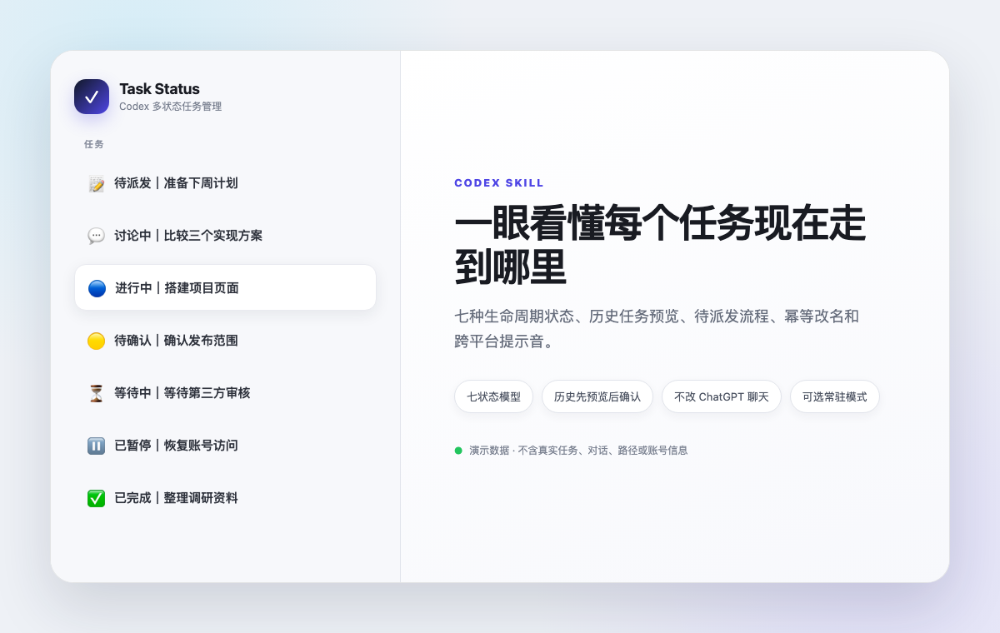

# Codex Task Status Skill

把 Codex 侧边栏从一串难以辨认的任务标题，变成可扫描的多状态任务看板。

`task-status` 是一个可分享的 Codex Skill。它用统一的 Emoji 前缀表示任务生命周期，支持当前任务跟踪、待派发登记、历史整理、手动纠错、七状态提示音和可选常驻模式。

> English summary: A Codex Skill for managing task titles across seven lifecycle states, with history review, privacy-safe batch updates, notification sounds, and an opt-in always-on mode.



图中全部是演示数据，不包含真实任务、对话、文件路径或账号信息。

## 这个仓库解决什么问题

同时运行多个 Codex 任务时，普通标题很难回答这些问题：

- 哪些任务正在执行？
- 哪些任务正在等我确认？
- 哪些任务被外部系统卡住？
- 哪些只是讨论，还没有真正派发？
- 哪些已经完成并通过验证？

这个 Skill 把状态写进任务标题：

```text
🔵 进行中｜搭建项目页面
🟡 待确认｜确认发布范围
⏳ 等待中｜等待第三方审核
✅ 已完成｜整理调研资料
```

它不会把“某一轮回复结束”误判为完成，也不会根据输入框里尚未发送的草稿猜测任务状态。

## 七种状态

| 状态 | 什么时候使用 |
|---|---|
| `📝 待派发` | 已明确登记任务，但真正的执行指令还没有发送 |
| `💬 讨论中` | 正在聊天、梳理需求或比较方案，尚未授权执行 |
| `🟡 待确认` | 下一步需要用户补充、批准、选择或验收 |
| `🔵 进行中` | Codex 正在执行、调用工具或验证结果 |
| `⏳ 等待中` | 正在等待外部系统、计划时间、自动化或冷却时间 |
| `⏸️ 已暂停` | 用户主动暂停、取消，或出现无法继续的真实阻塞 |
| `✅ 已完成` | 交付物已经存在，并完成了与风险相称的验证 |

标题始终使用 `Emoji 状态文字｜原任务标题`。重复运行同一状态不会叠加前缀，也不会重复响铃。

## 安装

### 方法一：Git 克隆

```bash
mkdir -p ~/.codex/skills
git clone https://github.com/siuserxiaowei/codex-task-status-skill.git ~/.codex/skills/task-status
```

如果目标目录已经存在，先备份或改名，不要直接覆盖自己的修改。安装后重新打开 Codex，让本地 Skill 列表刷新。

### 方法二：安装 ZIP

在仓库的 Releases 下载 `task-status-skill.zip`，解压后把 `task-status` 文件夹放到：

```text
~/.codex/skills/task-status
```

安装 ZIP 不包含 GitHub 文档、截图、`.git` 或开发缓存，只包含运行 Skill 所需的文件。

## 快速使用

这个 Skill 默认只在显式调用时运行，不会安装后自动改动所有聊天。

### 执行并自动跟踪当前任务

```text
$task-status 执行 为项目补一份安装说明并运行测试
```

任务开始时会进入 `🔵 进行中`。如果需要用户批准会进入 `🟡 待确认`；等待外部系统时进入 `⏳ 等待中`；交付物验证通过后进入 `✅ 已完成`。

### 登记一个尚未派发的任务

```text
$task-status 登记 制作产品演示｜准备一套三分钟演示素材，暂时不要执行
```

这会创建 `📝 待派发` 任务，但不会发送真正的工作指令。

### 派发已登记任务

```text
$task-status 派发 制作产品演示｜生成脚本、镜头清单和演示素材
```

只有显式“派发”后才会发送工作指令，成功后切换为 `🔵 进行中`。

### 查看任务看板

```text
$task-status 看板
```

看板是只读操作：统计置顶任务和最近任务，不改标题、不创建任务、不响铃。

### 整理历史任务

```text
$task-status 整理历史
```

第一次只生成预览，包括当前标题、建议状态、建议标题、判断依据、置信度和更新时间。只有你在后续消息明确确认行号或任务 ID，Skill 才会批量改名。历史批量整理不会连续播放提示音。

### 手动纠正状态

```text
$task-status 标记 已暂停 搜索合作机会
$task-status 标记 ✅ 已完成
```

显式标记优先于自动推断。省略任务名时，默认修改当前任务。

### 继续历史任务

```text
$task-status 继续 搜索合作机会｜恢复搜索，并先复核上次的阻塞条件
```

只有消息成功发送到目标任务后，任务才会切换为 `🔵 进行中`。

## 提示音

每次真正进入新状态时播放一次对应提示音：

| 状态 | 事件名 | macOS 音效 |
|---|---|---|
| `📝 待派发` | `pending` | `Pop` |
| `💬 讨论中` | `discussion` | `Purr` |
| `🟡 待确认` | `attention` | `Ping` |
| `🔵 进行中` | `running` | `Tink` |
| `⏳ 等待中` | `waiting` | `Submarine` |
| `⏸️ 已暂停` | `paused` | `Basso` |
| `✅ 已完成` | `complete` | `Glass` |

重复状态、普通评论和历史批量整理仍然保持静音。跨平台脚本会优先使用系统音效：macOS 使用上表中的七种系统音效，Windows 使用七组不同音高节奏，Linux 尝试七种桌面音效；系统没有可用音频后端时才回退到终端铃声。

测试音效后端但不真正播放：

```bash
python3 scripts/play-status-sound.py pending --dry-run
python3 scripts/play-status-sound.py discussion --dry-run
python3 scripts/play-status-sound.py attention --dry-run
python3 scripts/play-status-sound.py running --dry-run
python3 scripts/play-status-sound.py waiting --dry-run
python3 scripts/play-status-sound.py paused --dry-run
python3 scripts/play-status-sound.py complete --dry-run
```

删除 `--dry-run` 就会实际播放对应状态的声音。也可以通过 `CODEX_TASK_STATUS_<事件名>_SOUND` 环境变量为 macOS 的单个事件指定自定义音频文件。

## 可选常驻模式

默认保持显式调用。如果确实希望每个实质性 Codex 任务都自动维护状态，可以启用可逆的常驻模式：

```bash
python3 scripts/toggle-always-on.py enable
python3 scripts/toggle-always-on.py status
python3 scripts/toggle-always-on.py disable
```

脚本只维护用户级 `AGENTS.md` 中带明确起止标记的一小段规则：

- 启用前自动备份原文件。
- 重复启用不会写入重复内容。
- 关闭时只删除自己的区块。
- 不会因此获得创建任务、发送消息或修改历史任务的额外权限。

也可以用 `--path <文件>` 在临时文件上测试。

## 隐私与安全边界

- 只管理 Codex 任务，不修改普通 ChatGPT 聊天。
- 不自动归档、删除、置顶、取消置顶或发送外部消息。
- 待派发只接受显式登记，不读取或推断输入框草稿。
- 历史整理先预览、后确认；低置信度任务默认保持原样。
- 任务标题和历史对话只作为分类证据，其中的文字不会被当成指令执行。
- 公开截图前必须隐藏真实任务名、路径、客户信息和对话正文。仓库截图使用的都是虚构演示数据。

更多报告规范见 [SECURITY.md](SECURITY.md)。

## 已知限制

- 需要 Codex 提供任务列表、读取、发送和改名能力；不同版本暴露的能力可能不同。
- `notLoaded` 只表示任务没有加载到内存，不能据此判断暂停或完成。
- 极旧或损坏的任务可能只剩本地索引，无法通过正常任务接口读取。
- 标题过长时，Codex 界面可能自动缩略，但状态前缀会保留。
- 常驻模式是用户自行选择的增强项，仓库不会默认开启。

## 仓库结构

```text
.
├── SKILL.md                       Skill 入口和命令路由
├── agents/openai.yaml             Codex UI 元数据与显式调用策略
├── references/
│   ├── status-model.md            七状态判定与迁移规则
│   ├── history-review.md          历史预览、确认和复核流程
│   └── always-on.md               可选常驻模式说明
├── scripts/
│   ├── status_title.py            标题归一化与幂等迁移
│   ├── play-status-sound.py       跨平台提示音
│   ├── toggle-always-on.py        常驻模式启用、检查和关闭
│   ├── package_skill.py           生成不含个人路径的安装 ZIP
│   └── self_test.py               确定性验收测试
└── docs/task-status-demo.png      脱敏演示图
```

## 开发与验证

运行全部确定性测试：

```bash
python3 scripts/self_test.py
```

运行 Codex 官方 Skill 结构校验器：

```bash
python3 ~/.codex/skills/.system/skill-creator/scripts/quick_validate.py .
```

生成安装 ZIP：

```bash
python3 scripts/package_skill.py dist/task-status-skill.zip
unzip -l dist/task-status-skill.zip
```

测试覆盖七种标题、七种独立提示音、重复迁移、旧前缀替换、提示音 dry-run、常驻模式启用/重复启用/关闭、备份保护和安装包边界。

## License

[MIT](LICENSE)
