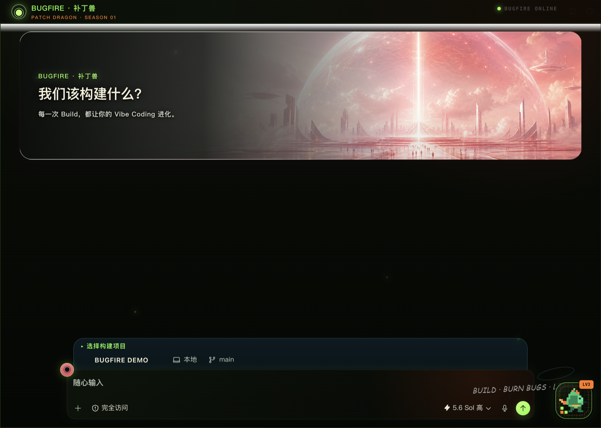
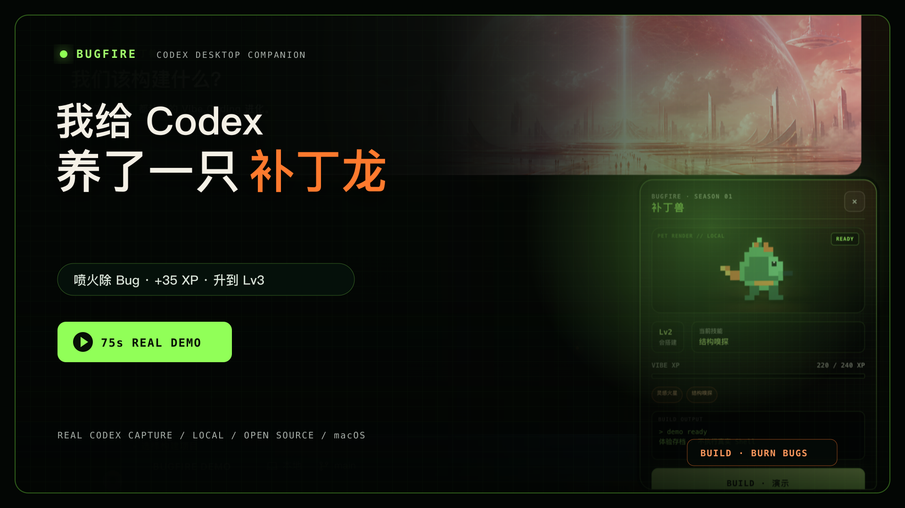
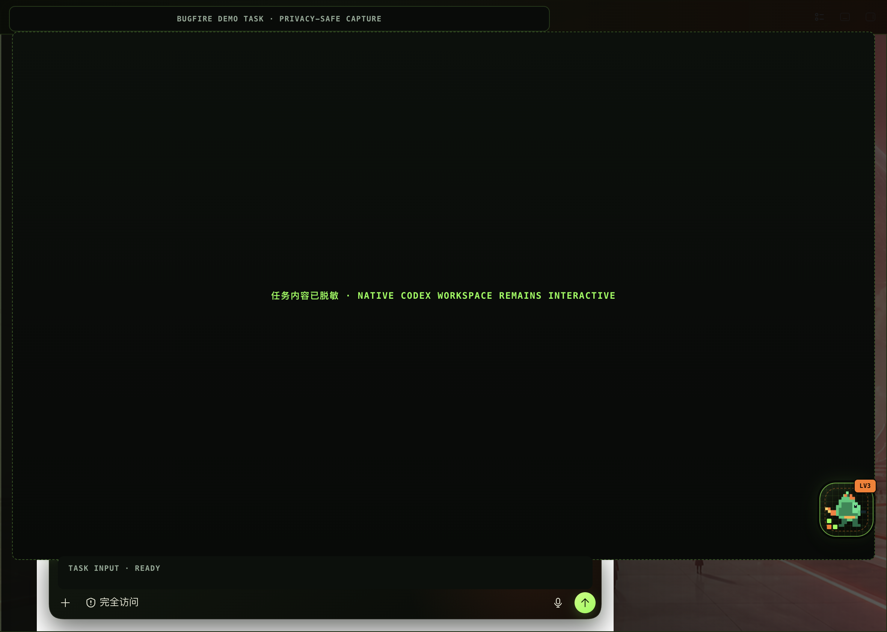
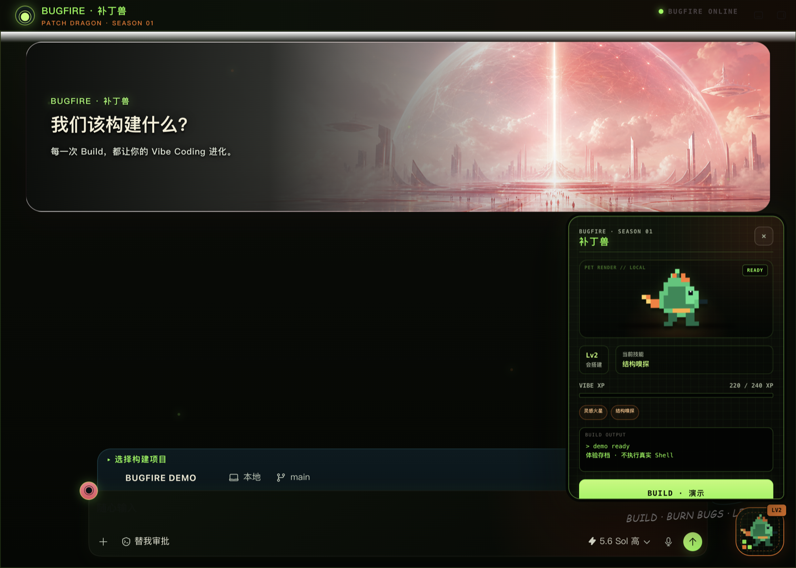
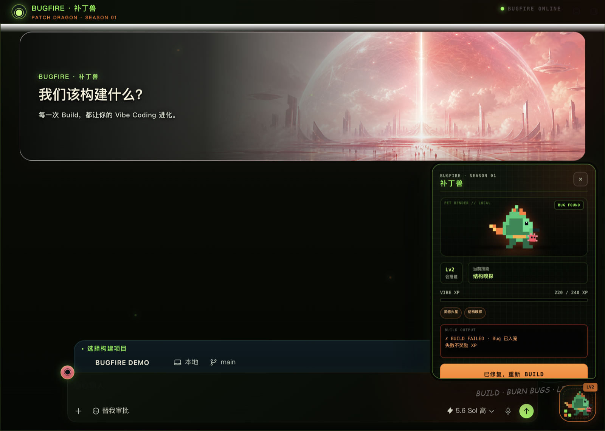
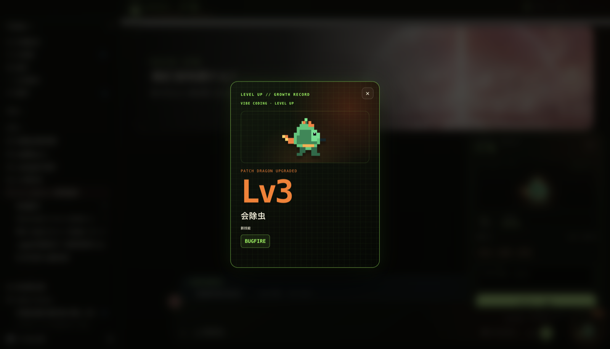
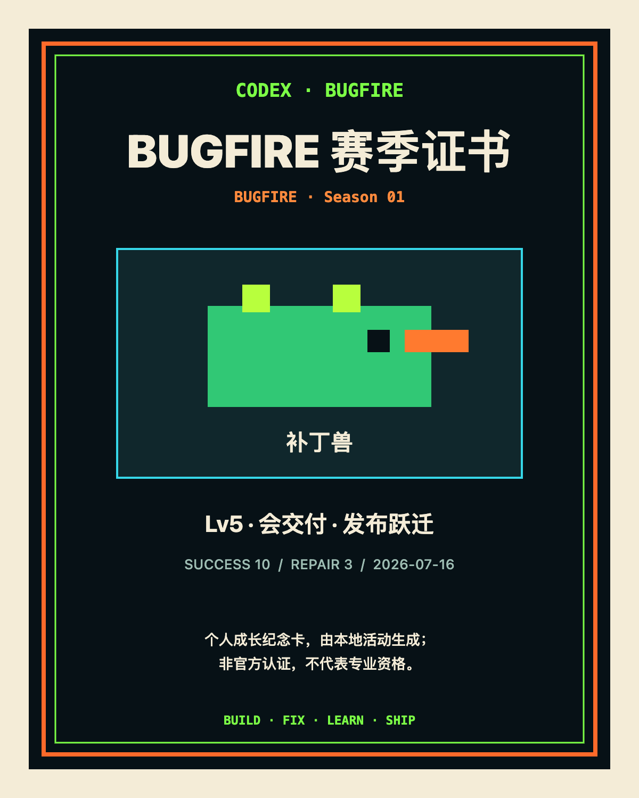

# BUGFIRE「补丁兽」：Codex Desktop 像素桌宠

[English](README.en.md)

[](https://siuserxiaowei.github.io/Codex-Bugfire-Skin/)
[](https://github.com/siuserxiaowei/Codex-Bugfire-Skin/releases/download/promo-v1-review-20260717/BUGFIRE-Promo-V2-Yunzhou-Cover.mp4)
[](https://github.com/siuserxiaowei/Codex-Bugfire-Skin/releases/latest)
[](https://github.com/siuserxiaowei/Codex-Bugfire-Skin/actions/workflows/ci.yml)
[](LICENSE)

**BUGFIRE「补丁兽」是一款运行在 macOS 版 Codex Desktop 里的本地像素桌宠。** 它用“模拟 Build → 发现 Bug → 修复重建 → 喷火升级”的可玩反馈，让 Vibe Coding 的练习过程更有成长感；它不会执行真实构建，也不把宠物等级包装成编程能力认证。

> 当前版本：`1.3.0-bugfire.1` · macOS 首版 · 非 OpenAI 官方产品



## 先看 75 秒真实 Codex 实机演示

[](https://github.com/siuserxiaowei/Codex-Bugfire-Skin/releases/download/promo-v1-review-20260717/BUGFIRE-Promo-V2-Yunzhou-Cover.mp4)

**[▶ 播放/下载 V2 新封面版 MP4](https://github.com/siuserxiaowei/Codex-Bugfire-Skin/releases/download/promo-v1-review-20260717/BUGFIRE-Promo-V2-Yunzhou-Cover.mp4)** · **[新封面版字幕 SRT](https://github.com/siuserxiaowei/Codex-Bugfire-Skin/releases/download/promo-v1-review-20260717/BUGFIRE-Promo-V2-Yunzhou-Cover.srt)** · **[全部宣传片与真实性记录](https://github.com/siuserxiaowei/Codex-Bugfire-Skin/releases/tag/promo-v1-review-20260717)**

视频中的功能画面来自真实 Codex Desktop 录屏；`DEMO BUILD` 是明确标注的模拟反馈，不监听 GitHub Actions，也不读取或修复源码。

**[▶ 打开在线交互 Demo](https://siuserxiaowei.github.io/Codex-Bugfire-Skin/)** · **[↓ 下载最新版](https://github.com/siuserxiaowei/Codex-Bugfire-Skin/releases/latest)** · **[🧩 制作自己的补丁兽](skills/codex-bugfire-customizer/SKILL.md)**

[使用说明](docs/USAGE.zh-CN.md) · [安全架构](docs/SECURITY-ARCHITECTURE.zh-CN.md) · [隐私说明](docs/PRIVACY.md) · [安全策略](SECURITY.md) · [GEO 分析](GEO-ANALYSIS.md) · [SEO/GEO 发布计划](SEO-PLAN.md) · [macOS 技术说明](macos/README.md)

## 新增：AI 角色导演，但最终决定权不交给 AI

`v1.3.0-bugfire.1` 加入一条可审计工作流：原创角色 brief → AI 结构化草案 → 人工明确否决并替换一项选择 → deterministic validator → build / preview → 可选 live install / verify / restore。

```bash
./contest/bugfire/run-demo.sh
```

无 API Key 时，Demo 使用由本项目 Codex agent 实际产出、SHA-256 锁定的离线 fixture，并明确标注“不是实时 API 调用、不是人工审批证明”；fixture 校验、review 和 materialize 都必须重新提供同一份由操作员控制的 human brief，并精确核对 brief 摘要与持久化 rights，不能靠跳过 `verify-fixture` 把伪造 rights 写入包。有兼容端点时，`bugfire-director.mjs draft-live` 会真实调用 Chat Completions 或 Responses API；Key 只从环境变量读取，响应与最终 plan 在写盘前都会递归拒绝 Key 的精确值，即使恶意端点把凭据回显进合法字段也不会产生文件；endpoint-controlled JSON 解析失败只输出固定错误文案，不拼接可能含 Key 的响应片段。响应若声明 `Content-Length` 会先做 1 MiB 预检，无论是否声明都由 body reader 流式累计，在首个越界 chunk 主动取消。live `manifestProposal.rights` 强制复制自人工 brief，AI 无权改写。AI 草案不能直接 materialize，人工替换也不能绕过原有 pack validator。

这里的 human brief 是调用者选择并保管的信任根：工具验证“当前 plan 是否仍与这份 brief 一致”，不认证 brief 作者身份，也不替用户证明真实版权。SHA-256 只是完整性摘要，不是签名。

[VibeLab 投稿与复现证据](contest/bugfire/README.md) · [AI fixture](contest/bugfire/demo/ai-draft-plan.json) · [人工 review 输入](contest/bugfire/demo/human-review.json) · [来源与归属](PROVENANCE.md)

> 页面上方的旧 75 秒 V2 是既有 BUGFIRE 工程实机证据，不用于证明这条新增 AI 导演流程。新增流程需按投稿包的 60–75 秒分镜另行录制。

## 现在可以做自己的补丁兽

项目提供 `Bugfire Pack v1` 和 [`codex-bugfire-customizer`](skills/codex-bugfire-customizer/SKILL.md) Skill。创作者不需要改注入器，只要准备一张背景图和一张 `idle` 宠物图，就能生成同一套模拟 Build、动作反馈、XP、成长卡、任务板和纪念卡系统；另外五张状态图可选，缺失时安全复用 `idle`。

宠物包只接受声明式 JSON 与本地 PNG/JPEG/WebP，不下载远程素材，也不执行包内 JavaScript/CSS。最小上传清单、可选素材、生成命令和分享边界见 [定制指南](docs/CUSTOMIZATION.zh-CN.md)，玩法取舍和同类项目证据见 [调研报告](docs/RESEARCH.md)。

## BUGFIRE 能做什么？

补丁兽常驻 Codex 右下角的 72 px 浮巢，点击后展开宠物舱。首次体验从 `Lv2 · 220/240 XP` 开始：第一次点击 `BUILD · 演示` 会明确失败且不增加 XP；点击“已修复，重新 Build”后，补丁兽喷火消灭 Bug，获得 35 XP 并升到 Lv3。整个流程是本地演示，不读取任务正文、源码、密钥或真实 Shell 输出。

| 关键事实 | 当前实现 |
| --- | --- |
| 平台 | macOS + 官方 Codex Desktop |
| 版本 | `1.3.0-bugfire.1` |
| Build | 明确标注的本地演示，不执行 Shell |
| 存档 | `~/Library/Application Support/CodexDreamSkinStudio/bugfire-progress.json`，权限 `0600` |
| 注入 | 使用仅绑定 `127.0.0.1` 的 Codex CDP；进度同步不另开端口 |
| 自定义宠物包 | 本地 `bugfire-pack` CLI；背景 + `idle` 图即可起步，五张状态图可选 |
| 官方应用改动 | 不修改 `.app`、`app.asar` 或代码签名 |
| 认证性质 | 本地成长纪念，不是能力评估或官方认证 |

### 核心体验

- 原创像素补丁龙与 `idle`、`building`、`bug`、`fire`、`success`、`level-up` 六种状态动画
- 五级 Vibe 成长路径、成长卡与可导出的 4:5 PNG 赛季纪念证书
- 任务页自动收起、`Esc` 收起、键盘可操作、窄窗口适配与 `prefers-reduced-motion`
- 本地原子存档；失败不奖励 XP，修复成功只结算一次
- 本地编译自定义宠物包：背景、六状态素材、配色、台词、任务板与纪念卡标题
- 保留 Codex 原生侧栏、项目选择器、任务区、输入框和菜单交互
- 一键验证、暂停与恢复，不修改官方 `.app`、`app.asar` 或代码签名



## Build 演示是怎样玩的？

| 步骤 | 画面反馈 | XP |
| --- | --- | ---: |
| 1. 打开右下角宠物浮巢 | 展开约 320 × 420 px 宠物舱 | 0 |
| 2. 点击 `BUILD · 演示` | 首次 Build 失败，生成一只 Bug | 0 |
| 3. 点击“已修复，重新 Build” | 补丁兽喷火，Build 成功 | +35 |
| 4. 达到升级阈值 | 解锁技能并生成成长卡 | 按当前进度 |

<p align="center">
  
  
</p>



> 公开截图按画面需要裁剪、覆盖或模糊原生侧栏，并用 `BUGFIRE DEMO` 覆盖真实项目名；任务正文、账户信息和本机路径不作为演示素材。

## 五级成长体系

| 等级 | XP | Vibe 阶段 | 技能 |
| --- | ---: | --- | --- |
| Lv1 | 0–99 | 会描述 | 灵感火星 |
| Lv2 | 100–239 | 会搭建 | 结构嗅探 |
| Lv3 | 240–449 | 会除虫 | BUGFIRE |
| Lv4 | 450–749 | 会验收 | 测试结界 |
| Lv5 | 750+ | 会交付 | 发布跃迁 |

Lv5 且累计完成 10 次成功 Build、3 次修复重建后，会生成赛季纪念证书。证书固定注明：

> 个人成长纪念卡，由本地活动生成；非官方认证，不代表专业资格。



## 如何安装？

### 环境要求

- macOS
- 已安装官方 Codex Desktop，并至少启动过一次
- 不要求全局安装 Node.js；安装器会先验证并使用 Codex 自带的签名 Node.js

### 双击安装

1. 下载或克隆本仓库。
2. 双击 [`macos/Install Codex Dream Skin.command`](macos/Install%20Codex%20Dream%20Skin.command)。
3. 首次启用时，按提示仅重启 Codex 一次。
4. 打开 Codex，在右下角寻找补丁兽浮巢。

### 终端安装

```bash
cd macos
./tests/run-tests.sh
./scripts/install-dream-skin-macos.sh --no-launch
~/.codex/codex-dream-skin-studio/scripts/start-dream-skin-macos.sh --prompt-restart
```

安装后的主要位置：

| 内容 | 路径 |
| --- | --- |
| 引擎 | `~/.codex/codex-dream-skin-studio` |
| 状态、日志、用户图片 | `~/Library/Application Support/CodexDreamSkinStudio` |
| 补丁兽进度 | `~/Library/Application Support/CodexDreamSkinStudio/bugfire-progress.json` |

完整的操作、验证、故障排查与恢复命令见 [中文使用说明](docs/USAGE.zh-CN.md)。

## 隐私和安全边界

BUGFIRE 运行时依赖一个仅绑定 `127.0.0.1` 的 Codex CDP 端口来注入样式和装饰组件。进度同步复用这条已验证的 renderer 会话，通过一个 `Runtime` binding 完成，不再另开网络端口。存档只记录 schema 版本、宠物/赛季 ID、XP、失败与成功次数、修复成功次数、技能、成长卡、已结算事件 ID 和更新时间。

桌宠运行时不会：

- 修改官方 Codex 安装包、`app.asar` 或代码签名
- 读取任务正文、项目源码、API Key、Base URL 或密钥
- 执行真实 Shell / Build 命令
- 把演示等级表述为客观编程水平或专业认证
- 从宠物包下载远程素材，或执行宠物包提供的脚本和样式

CDP 本身权限较高。主题运行期间不要运行来路不明的本机程序；不用时可暂停或完全恢复官方外观。

## 如何暂停或恢复？

暂停皮肤、保留 Codex 运行：

```bash
~/.codex/codex-dream-skin-studio/scripts/pause-dream-skin-macos.sh
```

移除实时注入并恢复安装前的外观设置：

```bash
~/.codex/codex-dream-skin-studio/scripts/restore-dream-skin-macos.sh \
  --restore-base-theme --restart-codex
```

也可以双击桌面的 `Codex Dream Skin - Restore.command`。

## 常见问题

### 它会自动运行我的项目 Build 吗？

不会。首版只有明确标注的可玩演示，不调用真实 Shell，也不接收项目内容。真实 Build 监听属于后续阶段，必须由用户单独授权允许的命令，并且只消费退出码。

### 宠物等级等于我的编程能力吗？

不等于。等级只反映这套本地演示中的活动进度，目的是提供节奏和纪念感，不是能力测评、职业资格或官方认证。

### 为什么第一次 Build 没有 XP？

这是设计的一部分：失败只生成 Bug；完成“修复重建”后才结算 35 XP。同一个修复事件不会重复奖励。

### 会遮住 Codex 输入框吗？

宠物舱进入任务页会自动收起，浮巢会避开输入区；同时支持 `Esc`、键盘操作、窄窗口和减少动态效果设置。

### 如何确认安装没有修改官方应用？

运行 `doctor-macos.sh --require-live` 与 `verify-dream-skin-macos.sh --reload`。验证脚本会检查官方签名、目标 renderer、注入状态和关键交互区域。

## 来源、许可与声明

本扩展基于 [Codex Dream Skin v1.1.2 的固定提交](https://github.com/Fei-Away/Codex-Dream-Skin/commit/2f038b5322702cfb248d9c7564b56470a389abc2) 制作，BUGFIRE 宠物、成长系统和动画为该独立扩展内容。代码许可见根目录 [`LICENSE`](LICENSE)（MIT），上游归属、运行边界和商标说明见 [`NOTICE.md`](NOTICE.md)。

本项目与 OpenAI 无隶属或背书关系。Codex、OpenAI 及相关商标归其各自权利人所有。
